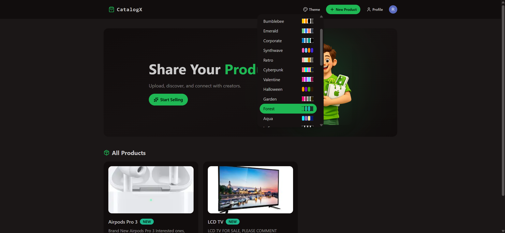
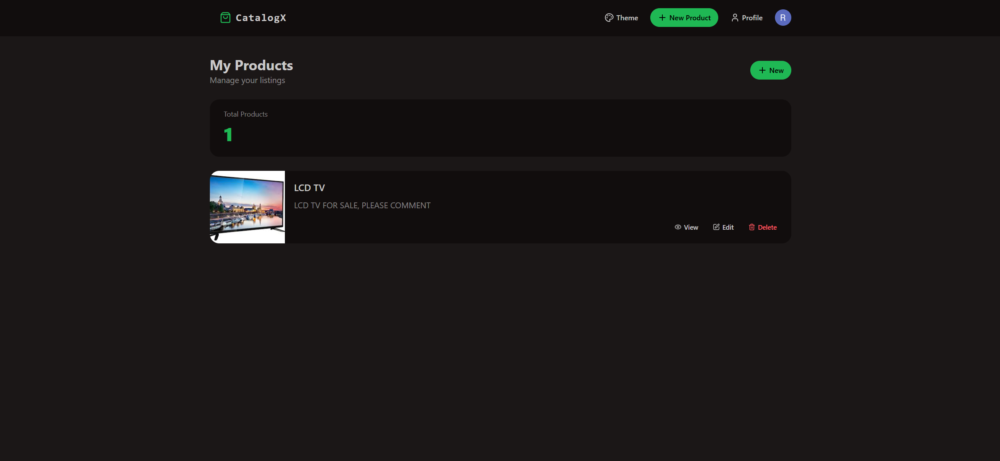

# ✨ CatalogX

CatalogX is a peer-to-peer product listing platform that allows users to create, manage, and browse items for sale. Built with a modern full-stack architecture featuring secure authentication, scalable APIs, and a responsive, data-driven UI.

---

## 🔗 Live Demo

🔗 https://vault-seven-pearl.vercel.app/

---




## 🚀 Features

- 🛒 Full-Stack Item Marketplace
- 🧰 REST API with Node.js & Express
- 🗄️ PostgreSQL Database Integration
- 🧬 Drizzle ORM for type-safe database queries
- 🟦 TypeScript Powered API
- ⚛️ Modern React Frontend
- 🎨 Beautiful UI with Tailwind CSS & DaisyUI
- ⚡ Data Fetching & Caching using TanStack Query
- 🔄 End-to-End API ↔ Frontend Integration
- 🧠 Clean Project Structure & Best Practices
- 🚀 Production Deployment on Vercel with Live URL

---

## 🧱 Tech Stack

### 🖥️ Frontend
- React  
- Vite  
- Tailwind CSS
- DaisyUI
- Axios
- Lucide Icons
- React Router  
- Clerk for authentication  
- TanStack Query

### 🗄️ Backend
- Node.js  
- Express
- Typescript
- PostgreSQL
- Drizzle ORM

---

## 📁 Project Structure
```
CatalogX/
├── backend/       # Express Backend
│   ├── src/
│       ├── config
│       ├── controllers
│       ├── db
│       ├── routes
│       └── index.ts
│
├── frontend/       # React Frontend
│   ├── src/
│       ├── components
│       ├── hooks
│       ├── lib
│       └── pages
```
---

## 🛠️ Getting Started

These instructions will help you run the project locally.

### 🎯 Prerequisites

Make sure you have:

- Node.js (v18+ recommended)
- npm or yarn
- PostgreSQL (Neon)
- Clerk account (for auth keys)

---

### 📦 Installation

Clone the repo:

```bash
git clone https://github.com/RachitJ05/CatalogX.git
cd CatalogX
```

Install backend dependencies:
```bash
cd backend
npm install
```

Install frontend dependencies:
```bash
cd frontend
npm install
```

### 🔧 Environment Variables

✨ Backend (backend/.env)

```env
PORT=3000
DATABASE_URL=<YOUR_DB_URL>
NODE_ENV=development

CLERK_PUBLISHABLE_KEY=<YOUR_CLERK_PUBLISHABLE_KEY>
CLERK_SECRET_KEY=<YOUR_CLERK_SECRET_KEY>

FRONTEND_URL=http://localhost:5173
```

✨ Frontend (frontend/.env)

```env
VITE_CLERK_PUBLISHABLE_KEY=<YOUR_CLERK_PUBLISHABLE_KEY>

VITE_API_URL=http://localhost:3000/api
```

### Run Locally

```bash
cd backend && npx drizzle-kit push && npm run dev
cd frontend && npm run dev
```
